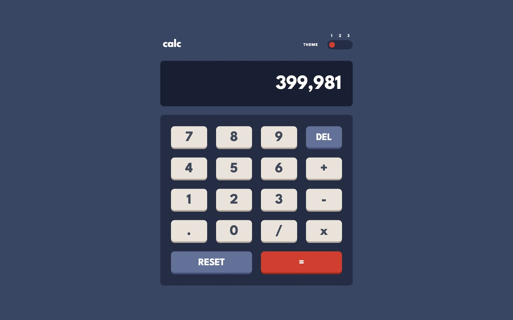

# Frontend Mentor - Calculator app solution

This is a solution to the [Calculator app challenge on Frontend Mentor](https://www.frontendmentor.io/challenges/calculator-app-9lteq5N29). Frontend Mentor challenges help you improve your coding skills by building realistic projects.

## Table of contents

- [Overview](#overview)
  - [The challenge](#the-challenge)
  - [Screenshot](#screenshot)
  - [Links](#links)
- [My process](#my-process)
  - [Built with](#built-with)
  - [What I learned](#what-i-learned)
- [Author](#author)

## Overview

### The challenge

Users should be able to:

- See the size of the elements adjust based on their device's screen size
- Perform mathmatical operations like addition, subtraction, multiplication, and division
- Adjust the color theme based on their preference
- **Bonus**: Have their initial theme preference checked using `prefers-color-scheme` and have any additional changes saved in the browser

### Screenshot

### Links

- Solution URL: [https://github.com/FerdinandoGeografo/calculator-app](https://github.com/FerdinandoGeografo/calculator-app)
- Live Site URL: [https://calculator-fg.netlify.app/](https://calculator-fg.netlify.app/)

## My process

### Built with

- Semantic HTML5 markup
- SASS following 7-1 pattern and BEM conventions
- Flexbox
- CSS Grid
- Desktop-first workflow
- [Angular](https://angular.dev/) - JS Framework
- [TypeScript](https://www.typescriptlang.org/) - Super set of Javascript
- [RxJS](https://rxjs.dev/) - Js library for reactive approach

### What I learned

This Frontend Mentor Challenge consists of developing a Calculator app allowing users to switch between three themes. There are no other specific requests but I chose to also manage decimal operations with floats.

The core point of this project was the management of the logic, even if I didn't use NgRX I let myself be guided by its core concepts to manage the state of the application within a service that exposes only a signal related to the result to be shown, that corresponds also to the first operand of the operations.

All the actions that modify the state are managed within the service that exposes a single action to the smart app component and this favors a decoupling between the application logic and the access of the data and the rendering in dumb components. The service acts like a Facade pattern that expose the state and handle events by actions dispatched from components by UI events.

Finally I also managed the bonus point by savig the state of the application in the local storage at each evaulation.

I opted to set a limit of maximum 10 decimal digits when formatting the displayed number. So the user can enter only 10 numbers after the decimal point at most.

## Author

- Frontend Mentor - [@FerdinandoGeografo](https://www.frontendmentor.io/profile/FerdinandoGeografo)
- LinkedIn - [@FerdinandoGeografo](https://www.linkedin.com/in/ferdinandogeografo/)
- GitHub - [@FerdinandoGeografo](https://github.com/FerdinandoGeografo/)
